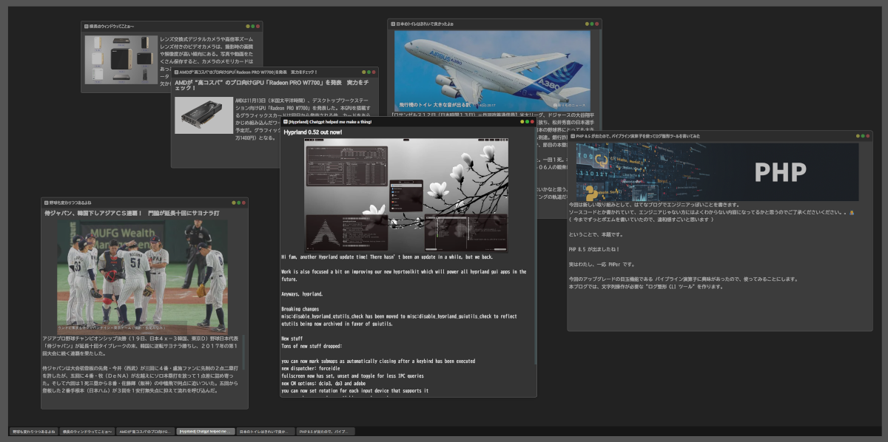

# sweWindow

Vanilla JS で動作する、ブラウザ上の「ウィンドウ・マネージャ」です。

- **サンプル (sample)**
  - https://scripcrypt.github.io/sweWindow/



---

## 1. 特徴

### 1.1 基本的なウィンドウ機能

- **移動**
  - ヘッダーをドラッグして移動
- **リサイズ**
  - 辺/角をドラッグしてリサイズ
- **ウィンドウボタン**
  - 最小化（黄）
  - 最大化（緑）
  - 閉じる（赤）
- **ヘッダーダブルクリック**
  - 最大化 `↔` 通常へ切り替え（最大化ボタンと同等）
- **タスクバー**
  - ウィンドウとタスクボタンは **1:1**
  - タスクボタンを押すと前面化
  - すでに前面なら最小化
  - 最小化中なら復元（最後の状態が最大化なら最大化へ戻る）

### 1.2 Dock / Overlay / autoHide（ドッキング）

ウィンドウを「帯（Band）」へドッキングして、左右/上下へ固定できます。

- **FloatLayer / DockBand / DockTab** のレイヤ構成で、
  - 浮動ウィンドウ
  - ドック帯
  - タブ（矢印/タイトル）
  が干渉しないように設計しています。
- **autoHide**
  - 折りたたみ時は帯本体を極小化し、タブ（矢印）だけ残して発見性を確保
  - 展開時は帯（BandContent + Divider）を表示

操作系の詳細は後述の「Dock 操作」を参照してください。

---

## 2. 依存関係 / ファイル構成

### 2.1 必須ファイル

本体は基本的にこの 2 ファイルです。

- `src/sweWindow.js`
  - 画面（sweScreen）とウィンドウ（sweWindow）のロジック
- `src/sweWindow.css`
  - 見た目（テーマ/アニメ/レイヤ設計）

### 2.2 SCSS について

このリポジトリには `src/sweWindow.scss` もあります。

- `src/sweWindow.scss`
  - `src/sweWindow.css` と等価になるように作成
  - コメント（意図説明）を SCSS 側へ集約する目的

---

## 3. クイックスタート

### 3.1 読み込み

```html
<link rel="stylesheet" href="src/sweWindow.css" />
<script defer src="src/sweWindow.js"></script>
```

### 3.2 最小構成の HTML

`.sweScreen` の直下に `.sweWindow` を配置します。

```html
<div id="targetScreen" class="sweScreen">
  <div class="sweWindow" window-title="Hello" width="420" height="280">
    content...
  </div>
</div>
```

### 3.3 起動（スクリーン化）

```js
new sweScreen("#targetScreen");
```

または要素を渡してもOKです。

```js
const el = document.querySelector("#targetScreen");
new sweScreen(el);
```

---

## 4. 生成される DOM 構造（概要）

`.sweWindow` は初期化後、概ね以下のように **frame + header + content** の構造に再編されます。

```html
<div class="sweWindowFrame">
  <div class="sweWindowHeader">
    <div class="sweWindowHeaderTitle">...</div>
    <div class="sweWindowHeaderButtons">
      <button class="minimize"></button>
      <button class="maximize"></button>
      <button class="close"></button>
    </div>
  </div>
  <div class="sweWindow">...</div>
</div>
```

---

## 5. 設定（HTML 属性）

各ウィンドウの初期設定は、`.sweWindow` 要素の属性で指定できます。

### 5.1 window-id

任意の文字列。外部からウィンドウを特定して操作するために使います。

- 未指定の場合は内部で自動採番（`win-<uuid>` 形式）

### 5.2 window-title

ウィンドウのタイトル。

- ヘッダーとタスクボタンに表示
- 長い場合は省略

### 5.3 top / left / width / height

初期位置/サイズ（単位 px）。未指定値は `sweScreen` のデフォルト設定で補完します。

### 5.4 url / html

`.sweWindow` の中身を外部から与えたい場合の指定です。

- `url="..."`
  - 外部 HTML を読み込む用途
- `html="..."`
  - 文字列として HTML を直接与える用途

### 5.5 type

コンテンツタイプ。現状は主にアイコン表示などの識別用（拡張用）です。

### 5.6 min-width / min-height

ウィンドウの最小サイズ。

### 5.7 focus

起動時にアクティブ化するかどうか。

- `focus="true"` / `focus="false"`

### 5.8 start-status

初期状態。

- `start-status="normal"`
- `start-status="maximize"`
- `start-status="minimize"`

### 5.9 resizable / movable / closable / minimizable / maximizable

各種制限（true/false）。

---

## 6. API（JavaScript）

### 6.1 sweScreen

スクリーン（ウィンドウ集合）を管理するクラスです。

- 生成

```js
const sc = new sweScreen("#targetScreen");
```

### 6.2 ウィンドウの追加

#### 6.2.1 DOM 要素を用意してから生成

```js
sc.createWindow();
```

- 引数なし: スクリーン内の `.sweWindow` をまとめて生成
- 引数に selector 文字列: 該当要素を検索して生成
- 引数に要素: その要素だけ生成

#### 6.2.2 JSON で生成

```js
sc.createWindow({
  windowId: "sample-1",
  windowTitle: "Title",
  rect: { top: 80, left: 80, width: 420, height: 280 },
  content: { kind: "url", value: "window_content_7.html" },
  type: "article",
  minSize: { width: 200, height: 200 },
  focus: true,
  idDup: "replace",
  startStatus: "normal",
  flags: {
    resizable: true,
    movable: true,
    closable: true,
    minimizable: true,
    maximizable: true,
  },
});
```

`content.kind`:

- `"url"`:
  - `value` に URL/パス
- `"html"`:
  - `value` に HTML 文字列
- `"node"`:
  - `value` に `.sweWindow` 要素

### 6.3 ウィンドウ取得

```js
const frame = sc.getWindow("sample-1");
const win = sc.getWindowInstance("sample-1");
```

- `getWindow(id)`
  - DOM（frameNode）を返す
- `getWindowInstance(id)`
  - `sweWindow` インスタンスを返す

### 6.4 ウィンドウ操作（ctrlWin）

```js
sc.ctrlWin("sample-1", "focus");
sc.ctrlWin("sample-1", "minimize");
sc.ctrlWin("sample-1", "maximize");
sc.ctrlWin("sample-1", "close");
```

`action`:

- `focus`
- `maximize`
- `minimize`
- `close`

`sweWindow` インスタンスから直接呼ぶこともできます。

```js
const win = sc.getWindowInstance("sample-1");
win.ctrlWin("focus");
```

---

## 7. Dock 操作（マウス操作の要点）

Dock/Overlay まわりは操作が増えるので、ここにまとめます。

- **通常の移動**
  - ヘッダーをドラッグ
- **ドック中（帯の中）**
  - 通常ドラッグは抑止され、構造操作（Ctrl/Shift）で扱う設計
- **Ctrl + ドラッグ（子ウィンドウ）**
  - 親から離脱（detach）してフロートへ戻し、そのままドラッグ継続
- **Ctrl/Shift + ドラッグ（ドック帯）**
  - undock して floatLayer に移してからドラッグ継続

※細部は実装側（`src/sweWindow.js`）のコメントが一次情報です。

---

## 8. イベントフック

ウィンドウにイベントが発生した時に実行するフック関数を設定できます。

- `onReady`
  - ウィンドウ生成完了
- `onClose`
  - 閉じた
- `onFocus`
  - 前面化
- `onMaximize`
  - 最大化
- `onUnMaximize`
  - 最大化解除
- `onMinimize`
  - 最小化
- `onUnMinimize`
  - 最小化解除
- `onMoveStart`
  - 移動/リサイズ開始
- `onMoveEnd`
  - 移動/リサイズ終了

例は `test-sweWindow.js` を参照してください。

---

## 9. SCSS → CSS のビルド（任意）

`src/sweWindow.scss` は `src/sweWindow.css` と等価になるように用意しています。

### Dart Sass

```bash
sass src/sweWindow.scss src/sweWindow.css
sass --watch src/sweWindow.scss:src/sweWindow.css
```

---

## 10. 注意点 / 制限

- 複数の `.sweScreen` を一括で初期化する機能はありません。
  - 例: `.screen` セレクタで複数あっても最初の 1 つのみ
- 省略すると `<body>` がスクリーンになります。
- 見た目のカスタマイズは `src/sweWindow.css`（または `src/sweWindow.scss`）の変数を中心に調整してください。

---

## 免責 / ライセンス

本リポジトリのソースコードは MIT ライセンスです。
